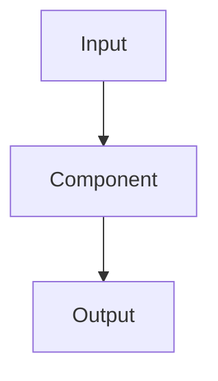

# Documentation Rule

## When This Rule Applies

After **every code change that has been fully implemented and approved** (i.e., the user has confirmed the implementation is correct), you MUST update or create the relevant documentation. Do not document partial or in-progress work.

Scope mapping — changes in these locations drive docs in:

| Changed path          | Documentation target     |
|-----------------------|--------------------------|
| `package/**`          | `docs/package/`          |
| `cli/**`              | `docs/cli/`              |
| `scripts/**`          | `docs/scripts/`          |
| `experiments/**`      | `docs/experiments/`      |
| Root / cross-cutting  | `docs/architecture/`     |

---

## Documentation Structure

Every package/module documentation folder (`docs/<package>/`) MUST contain:

```
docs/<package>/
  README.md          ← entry point, links to all sections below
  philosophy.md      ← why this exists and design intent
  architecture.md    ← structural decisions, component relationships, flow diagrams
  api.md             ← full public API reference (auto-generated style)
  implementation.md  ← internal design, algorithms, key data structures
```

---

## File Templates

### `README.md`
```markdown
# <Package Name>

> One-sentence purpose statement.

## Contents
- [Philosophy](philosophy.md)
- [Architecture](architecture.md)
- [API Reference](api.md)
- [Implementation Details](implementation.md)

## Quick Start
<!-- minimal working example -->
```

---

### `philosophy.md`
```markdown
# Philosophy — <Package Name>

## Problem Statement
<!-- What problem does this solve and why does it need to exist? -->

## Design Intent
<!-- Core principles guiding all decisions in this package -->

## What This Is Not
<!-- Explicit non-goals to prevent scope creep -->

## Trade-offs Accepted
<!-- Conscious compromises made and why -->
```

---

### `architecture.md`
```markdown
# Architecture — <Package Name>

## Component Overview
<!-- High-level description of major components and their roles -->

## Flow Diagram
<!-- Use ASCII or Mermaid. Show the primary data/control flow. -->



## Key Architectural Choices
<!-- Numbered list of significant decisions with rationale -->
1. **Choice**: description
   - **Why**: rationale
   - **Alternative considered**: what was rejected and why

## Dependencies
<!-- Internal and external dependencies with justification for each -->

## Extension Points
<!-- Where and how this can be extended without modification -->
```

---

### `api.md`
```markdown
# API Reference — <Package Name>

> All public interfaces. Updated automatically after approved changes.

## Classes

### `ClassName`
**Purpose**: one line
**Location**: `package/module.py`

#### Constructor
```python
ClassName(param: type, ...) -> ClassName
```
| Parameter | Type | Default | Description |
|-----------|------|---------|-------------|
| `param`   | type | —       | description |

#### Methods

##### `method_name(args) -> return_type`
Description.

**Parameters**: table as above
**Returns**: description
**Raises**: list exceptions
**Example**:
```python
obj = ClassName(...)
result = obj.method_name(...)
```

---

## Functions

### `function_name(args) -> return_type`
Description.

**Parameters**: table
**Returns**: description
**Example**: minimal snippet

---

## Constants / Configuration

| Name | Type | Value | Description |
|------|------|-------|-------------|
```

---

### `implementation.md`
```markdown
# Implementation Details — <Package Name>

## Module Map
<!-- File-by-file purpose summary -->
| File | Purpose |
|------|---------|

## Core Algorithms
<!-- For each non-trivial algorithm: name, inputs, outputs, complexity, key steps -->

### Algorithm: `name`
**Purpose**: ...
**Complexity**: O(...)
**Key steps**:
1. ...

## Data Structures
<!-- Explain non-obvious structures and why they were chosen -->

## Internal Invariants
<!-- Assumptions the code relies on that are not obvious from the types -->

## Known Limitations
<!-- Technical debt, edge cases not handled, performance cliffs -->

## Testing Notes
<!-- How to verify correctness, what scenarios are covered, what isn't -->
```

---

## Execution Instructions

When triggered, follow these steps in order:

1. **Identify changed package** — determine which top-level package/module changed.
2. **Check if `docs/<package>/` exists** — if not, create it with all five files using the templates above.
3. **Update only the affected sections** — do not rewrite sections unrelated to the change.
4. **API doc is non-negotiable** — `api.md` must reflect the current public interface exactly. If a function/class was added, modified, or removed, update the API doc to match.
5. **Flow diagrams on structural change** — if the data flow or component relationships changed, update the Mermaid diagram in `architecture.md`.
6. **Cross-package impact** — if the change affects how multiple packages interact, update `docs/architecture/` as well.
7. **No speculative docs** — only document what exists in the approved implementation. Do not document planned or future work.
