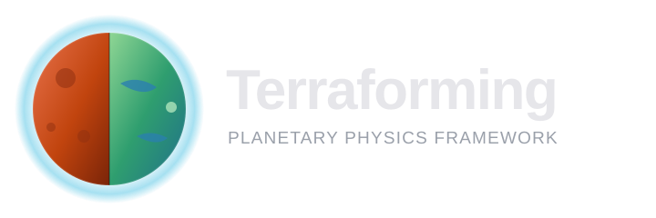

<div align="center">



<h1>Terraforming</h1>

<h3>A physics-based simulation framework for terraforming planets, moons, and solar systems</h3>

[](https://github.com/BioMedAI-UCSC/terraforming/actions/workflows/tests.yml)
[](https://github.com/BioMedAI-UCSC/terraforming/actions/workflows/docs-deploy.yml)
[](https://biomedai-ucsc.github.io/terraforming-docs/)
[](https://www.python.org/)
[](https://docs.astral.sh/uv/)
[](#license)

**[Documentation](https://biomedai-ucsc.github.io/terraforming-docs/)** ·
[Quickstart](https://biomedai-ucsc.github.io/terraforming-docs/getting-started/quickstart/) ·
[CLI Reference](https://biomedai-ucsc.github.io/terraforming-docs/cli/commands/) ·
[Architecture](https://biomedai-ucsc.github.io/terraforming-docs/architecture/planet/)

</div>

---

## Overview

**Terraforming** is the hypothetical process of deliberately modifying a world's
atmosphere, temperature, surface, and ecology to make it habitable for Earth life.
The core challenge is an **energy-balance problem**: enough heat must be retained by
the atmosphere to sustain liquid water and breathable pressures at the surface.

This project is a physics-based simulation framework that models these processes for
**planets, moons, and eventually whole solar systems**. It represents any body as a
**state vector** of thermodynamic and atmospheric quantities that evolve continuously
under physical forcing:

$$\mathbf{y}(t) = \bigl(T,\; P,\; M_\text{ice},\; \ldots\bigr)$$

The framework defines *how* that state changes — balancing incoming solar radiation,
outgoing thermal emission, greenhouse retention, orbital mechanics, and any engineered
interventions — without prescribing body-specific constants. Each celestial body supplies
its own orbital parameters, atmospheric composition, and physical constants while
inheriting the shared integration infrastructure.

The command-line tool that drives the framework is called **`tform`**.

## Highlights

- **Generic celestial framework** — abstract planet, atmosphere, orbital, thermal, and
  radiation models that extend to any body in the solar system.
- **Intervention engine** — super-greenhouse gas injection (SF₆, CF₄, C₂F₆, …) with a
  radiative-forcing registry and injection scheduler for multi-decade campaigns.
- **Fast + accurate integrators** — an RK4 accurate mode and a reduced-order fast path,
  with a batched controller for multi-site sweeps.
- **Batteries-included CLI** — presets, YAML configs, CSV output, and plots via `tform`.
- **Live visualizer** — a browser UI that streams each physics step in real time.

## Modules

| Package | Description |
|---------|-------------|
| `src.framework` | Abstract planet, atmosphere, and orbital-mechanics base classes |
| `src.celestials` | Concrete body implementations (currently Mars) — solar flux, climate ODE, polar caps |
| `src.engine` | RK4 / fast-path integrators and the batched simulation controller |
| `src.interventions` | GHG compound registry, radiative forcing, and injection scheduler |

## Installation

The project uses [uv](https://docs.astral.sh/uv/) for environment and package management.

```bash
# 1. Install uv (macOS / Linux)
curl -LsSf https://astral.sh/uv/install.sh | sh

# 2. Clone and sync
git clone https://github.com/BioMedAI-UCSC/terraforming.git
cd terraforming
uv sync --dev
```

## Command-line interface (`tform`)

`tform` is the primary way to run simulations. Commands follow the pattern
`tform <body> <command> [options]`, with built-in presets, YAML configs, CSV output,
and automatic plotting.

```bash
# Single sol (diurnal cycle) at Gale Crater
tform mars run --preset gale-crater --type sol

# One Martian year of the current Mars baseline
tform mars run --preset current-mars --type year

# Multi-latitude run (45°N, equator, 40°S)
tform mars run --preset equatorial --type multi

# Four landmark sites in one run
tform mars run --preset landmark-spots --type spots

# Terraforming intervention: GHG injection over years
tform mars run --preset terraforming-phase1 --type intervention
```

Runs can also be driven entirely from a custom YAML config:

```bash
tform mars config validate my-sim.yaml
tform mars run --config my-sim.yaml
```

Results are written to `outputs/` as CSV and plotted automatically (pass `--no-plot` to
suppress). Run `tform man` or `tform --help` for the full command and flag reference, or
see the [CLI Reference](https://biomedai-ucsc.github.io/terraforming-docs/cli/commands/).

## Visualizer

An interactive browser-based visualizer streams simulations live as they run. It is a
React + Vite + Recharts front end served by a FastAPI backend that runs each simulation
in a thread pool and pushes every physics step to the browser over Server-Sent Events.

```bash
# Start the visualizer and open it in your browser
tform serve

# Custom port, or hand off to a Vite dev server on :5173
tform serve --port 9000
tform serve --dev
tform serve --no-browser
```

The UI lets you configure a run, launch it, and watch temperature, pressure, and ice-mass
trajectories update in real time; completed runs are also saved as CSV under
`outputs/server/`.

## Mars

Mars is the framework's first fully-implemented target and its primary current focus. The
Mars model (`src.celestials`) includes:

- **Realistic orbital forcing** — eccentricity ($e = 0.0934$) and axial tilt ($25.19°$)
  driving seasonal solar flux across a full Martian year (~687 Earth days).
- **Climate ODE** — coupled surface temperature, atmospheric pressure, and polar CO₂-ice
  mass, with cap sublimation/deposition and pressure seasonality.
- **Elevation-aware sites** — landmark presets such as Olympus Mons, Elysium Mons,
  Hellas Basin, and the South Polar Cap with elevation-corrected initial conditions.
- **Terraforming campaigns** — multi-year super-greenhouse-gas injection scenarios that
  track radiative-forcing accumulation and the resulting temperature/pressure trajectory.

See the [Mars wiki](https://biomedai-ucsc.github.io/terraforming-docs/wiki/mars/) for the
full solar-flux, climate, and intervention models.

## Goals

The project aims to be a rigorous, extensible sandbox for asking *what would it actually
take* to make another world habitable:

- **Ground terraforming in physics, not hand-waving.** Every intervention resolves to a
  radiative-forcing and mass-balance change with traceable units and assumptions.
- **A reusable, body-agnostic framework.** Mars is the first target, but the
  state-vector / forcing architecture is designed to generalise across the solar system.
- **Honest energy and mass accounting.** Track volatile reservoirs, polar caps, and
  atmospheric column budgets so that "it warms up" is always backed by conserved quantities.
- **Reproducible experiments.** Presets, YAML configs, and CSV outputs make every run
  auditable and repeatable.

## Roadmap

- **Differentiable framework** — end-to-end differentiable integration to optimise
  intervention schedules against habitability targets *(planned)*.
- **More celestial bodies** — additional planets and moons on top of the shared framework.
- **Solar-system-scale modelling** — coupled multi-body scenarios beyond a single world.
- **Richer atmospheric chemistry** — coupled photochemistry and multi-species evolution.
- **Magnetic-field interventions** — artificial magnetosphere modelling for atmospheric
  retention.
- **Scenario tooling & UI** — richer visualisation and comparison of terraforming pathways.

See [`docs/`](docs/) and open issues for detailed design notes and in-progress work.

## Documentation

Full documentation — concepts wiki, CLI reference, architecture, and API — lives at:

**➡️ https://biomedai-ucsc.github.io/terraforming-docs/**

Docs are built with MkDocs Material. Preview locally with:

```bash
uv run mkdocs serve
```

## Development

```bash
uv sync --dev

# Package tests (framework, engine, celestials, interventions)
cd package && uv run python -m pytest tests/ -v -m "not slow"

# CLI tests
cd cli && uv run python -m pytest tests/ -v

# Type checking
uv run pyright
```

Tests and docs are validated in CI on every pull request — see the badges above.

## License

License is to be determined. Until a license is added, all rights are reserved by the
authors ([BioMedAI-UCSC](https://github.com/BioMedAI-UCSC)).
