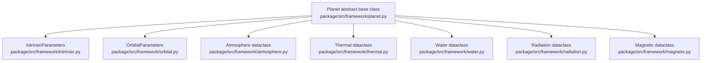

# Planet Simulation Architecture

## High-Level Design (HLD)

### 1. System Overview

The terraforming simulation system models planetary properties and their evolution over time. The architecture uses an abstract `Planet` class as the foundation, with concrete implementations (e.g., `Mars`) that define planet-specific parameters.

### 2. Core Architecture Components

```
┌─────────────────────────────────────────────────────────────┐
│                    Simulation Engine                         │
│  ├─ Time Controller (simulation speed, timestep)            │
│  └─ State Manager (snapshot, restore, history)              │
└─────────────────────────────────────────────────────────────┘
                        
┌─────────────────────────────────────────────────────────────┐
│                   Planet (Abstract Base)        
│  ├─ Inherent Time variable                 │
│  ├─ Physical Properties (mass, radius, orbit)               │
│  ├─ Environmental State (temp, pressure, atmosphere)         │
│  ├─ Planetary Systems (magnetic, radiation, wind)            │
│  └─ Temporal System (orbital timer, seasonal cycles)         │
└─────────────────────────────────────────────────────────────┘
                            │
          ┌─────────────────┼─────────────────┐
          ▼                 ▼                 ▼
    ┌─────────┐       ┌─────────┐      ┌─────────┐
    │  Mars   │       │  Earth  │      │  Venus  │
    └─────────┘       └─────────┘      └─────────┘
```

### 2.1 Verified Framework Composition (Current Code)

In the current code, `Planet` is the main container. It holds smaller pieces that each track one part of the model:

- `Atmosphere`
- `Thermal`
- `Water`
- `Radiation`
- `Magnetic`
- `IntrinsicParameters`
- `OrbitalParameters`

All of these live under `package/src/framework/`.



### 3. Simulation Flow

```
Initialize Planet → Set Initial Conditions → Start Simulation Loop
                                                    │
                    ┌───────────────────────────────┘
                    ▼
            Update Orbital Timer (Δt)
                    │
                    ▼
        Calculate Solar Radiation Input
                    │
                    ▼
    ┌───────────────────────────────────┐
    │   Update All Subsystems (Δt)     │
    │   ├─ Atmospheric System           │
    │   ├─ Thermal System                │
    │   ├─ Magnetic Field System         │
    │   ├─ Radiation Environment         │
    │   └─ Wind/Circulation System       │
    └───────────────────────────────────┘
                    │
                    ▼
        Update Planetary State
                    │
                    ▼
        Record/Display Results
                    │
                    ▼
        Check End Condition → Continue/Stop
```

### 4. Key Systems and Properties

#### 4.1 Core Physical Properties (Immutable/Slowly Changing)
- **Mass** ($M$): kg
- **Radius** ($R$): m
- **Gravity** ($g$): m/s² = $GM/R^2$
- **Orbital Parameters**: semi-major axis, eccentricity, period
- **Axial Tilt**: degrees

#### 4.2 Environmental State Variables (Dynamic)
- **Surface Temperature** ($T_\text{surf}$): K
- **Atmospheric Pressure** ($P_\text{atm}$): Pa
- **Atmospheric Composition**: {CO₂, N₂, O₂, H₂O, Ar, …} (partial pressures)
- **Water Inventory**: ice mass, liquid mass, vapour mass (kg)
- **Albedo** ($\alpha$): 0–1

#### 4.3 Planetary Systems
- **Magnetic Field System**
  - Field strength ($B$): Tesla
  - Magnetosphere boundary: $R_\text{magnetopause}$
- **Radiation Environment**
  - Solar radiation flux at current orbital distance: W/m²
  - Cosmic ray flux
  - Surface UV intensity
- **Atmospheric Circulation**
  - Wind patterns (velocity fields)
  - Heat transport efficiency
- **Thermal Balance**
  - Incoming solar radiation
  - Outgoing thermal radiation
  - Greenhouse effect

### 5. Time System

#### 5.1 Orbital Timer
- **Simulation Time** ($t_\text{sim}$): Real elapsed time in the simulation (seconds)
- **Planetary Year**: Based on orbital period
- **Sol/Day**: Based on rotation period
- **Orbital Position**: $\theta$ (angle around Sun, $0$–$2\pi$)

#### 5.2 Time Control
- **Time Scale Factor** (speed): Ratio of simulation time to wall-clock time
  - Example: speed=1000 → 1 second real-time = 1000 seconds sim-time
- **Timestep** ($\Delta t$): Integration timestep for numerical solvers
- **Adaptive timestep**: Adjust $\Delta t$ based on rate of change

---

## Low-Level Design (LLD)

<details>
<summary><strong>§1. Class Structure</strong></summary>


```python
# Base Classes

class Planet(ABC):
    """Abstract base class for planetary bodies"""
    
    # Core Properties
    mass: float                    # kg
    radius: float                  # m
    rotation_period: float         # seconds
    
    # Orbital Properties
    orbital_params: OrbitalParameters
    
    # State Variables
    state: PlanetaryState
    
    # Systems
    atmosphere_system: AtmosphereSystem
    thermal_system: ThermalSystem
    magnetic_system: MagneticFieldSystem
    radiation_system: RadiationSystem
    wind_system: WindSystem
    
    # Time
    orbital_timer: OrbitalTimer
    
    @abstractmethod
    def initialize_state(self) -> PlanetaryState:
        """Set initial conditions for the planet"""
        pass
    
    @abstractmethod
    def update(self, dt: float) -> None:
        """Update all systems for timestep dt"""
        pass


class Mars(Planet):
    """Mars-specific implementation"""
    
    def initialize_state(self) -> PlanetaryState:
        """Initialize Mars with current conditions"""
        pass


# Supporting Classes

class OrbitalParameters:
    semi_major_axis: float         # m
    eccentricity: float            # 0-1
    orbital_period: float          # seconds
    axial_tilt: float              # radians
    
    def distance_from_sun(self, theta: float) -> float:
        """Calculate distance at orbital angle theta"""
        pass


class OrbitalTimer:
    """Manages simulation time and orbital position"""
    
    current_time: float            # simulation seconds since epoch
    orbital_angle: float           # radians (0-2π)
    time_scale: float              # simulation speed multiplier
    
    def advance(self, dt: float) -> None:
        """Advance time by dt seconds"""
        pass
    
    def get_solar_distance(self, orbital_params: OrbitalParameters) -> float:
        """Current distance from sun"""
        pass
    
    def get_day_of_year(self, orbital_period: float) -> float:
        """Day within current orbital year"""
        pass


class PlanetaryState:
    """Complete state snapshot at a given time"""
    
    # Atmospheric
    surface_pressure: float        # Pa
    atmospheric_mass: float        # kg
    composition: dict[str, float]  # gas name → partial pressure (Pa)
    
    # Thermal
    surface_temperature: float     # K
    subsurface_temp_profile: np.ndarray  # Temperature vs depth
    
    # Water
    ice_mass: float                # kg
    liquid_mass: float             # kg
    vapor_mass: float              # kg
    
    # Radiation
    albedo: float                  # 0-1
    greenhouse_factor: float       # dimensionless
    
    # Magnetic
    magnetic_field_strength: float # Tesla at surface
    
    # Wind
    wind_velocity_field: np.ndarray  # 3D velocity field (if spatial)
    
    def copy(self) -> 'PlanetaryState':
        """Deep copy of state"""
        pass
```

</details>

<details>
<summary><strong>§2. System Classes</strong></summary>


```python
class AtmosphereSystem:
    """Models atmospheric composition and pressure"""
    
    def update(self, dt, state, solar_flux):
        # Calculate escape rates, update composition, mass, pressure
        pass

    def calculate_escape(self, state, solar_flux):
        # Jeans escape: Φ = n(R) × v̄ × exp(-λ), λ = GMm/(kTR)
        pass


class ThermalSystem:
    """Models planetary heat balance"""
    
    def update(self, dt, state, solar_flux):
        # Energy balance: dE/dt = Q_solar_absorbed - Q_thermal_emitted + Q_internal
        sigma = 5.67e-8
        T_eff = state.surface_temperature / state.greenhouse_factor
        Q_out = sigma * T_eff**4 * 4 * np.pi * self.planet.radius**2
        pass

    def calculate_greenhouse(self, composition):
        pass


class MagneticFieldSystem:
    """Models planetary magnetic field"""
    
    def update(self, dt, state):
        # Magnetopause standoff: R_mp ∝ (B²/(μ₀ρ_sw V_sw²))^(1/6)
        pass

    def get_magnetopause_distance(self, state, solar_wind_pressure):
        pass


class RadiationSystem:
    """Models radiation environment"""
    
    solar_constant_1AU = 1361  # W/m² at 1 AU
    
    def calculate_solar_flux(self, distance_from_sun):
        # F = F₀ × (1 AU / d)²
        AU = 1.496e11
        return self.solar_constant_1AU * (AU / distance_from_sun)**2
    
    def calculate_surface_uv(self, state, solar_flux):
        # Beer-Lambert: I = I₀ × exp(-τ)
        pass
    
    def calculate_cosmic_ray_flux(self, state):
        # Magnetic + atmospheric shielding
        pass


class WindSystem:
    """Models atmospheric circulation"""
    
    def update(self, dt, state):
        # Simplified global heat redistribution
        pass
```

</details>

<details>
<summary><strong>§3. System of Equations Summary</strong></summary>


#### 3.1 Atmospheric Mass Balance

$$\frac{dM_\text{atm}}{dt} = \dot{M}_\text{outgassing} + \dot{M}_\text{impacts} - \dot{M}_\text{escape} - \dot{M}_\text{sequestration}$$

where the Jeans escape flux is:

$$\dot{M}_\text{escape} \approx n(R)\,\bar{v}\,A_\text{exo}\,e^{-\lambda}, \qquad \lambda = \frac{GMm}{k_B T R_\text{exo}}$$

**Reference**: [Atmospheric Escape — Wikipedia](https://en.wikipedia.org/wiki/Atmospheric_escape)

#### 3.2 Energy Balance (Stefan-Boltzmann Law)

$$C\frac{dT}{dt} = (1-\alpha)\,F_\text{solar}\,\pi R^2 - \varepsilon\,\sigma\left(\frac{T}{f_\text{gh}}\right)^4 4\pi R^2 + Q_\text{int}$$

where:

| Symbol | Meaning |
|--------|---------|
| $C$ | Heat capacity (atmosphere + surface) |
| $\alpha$ | Bond albedo |
| $F_\text{solar}$ | Solar flux at current orbital distance |
| $f_\text{gh}$ | Greenhouse enhancement factor |
| $Q_\text{int}$ | Internal heat sources |
| $\sigma = 5.670\times10^{-8}$ W m⁻² K⁻⁴ | Stefan-Boltzmann constant |

**References**:
- [Stefan-Boltzmann Law — Wikipedia](https://en.wikipedia.org/wiki/Stefan%E2%80%93Boltzmann_law)
- [Planetary Energy Balance — UCAR](https://scied.ucar.edu/learning-zone/how-climate-works/energy-balance)

#### 3.3 Pressure Calculation (Barometric Formula)

Surface pressure from hydrostatic equilibrium:

$$P_\text{surf} = \frac{M_\text{atm}\,g}{4\pi R^2}$$

Scale height:

$$H = \frac{k_B T}{\mu\,g}$$

Isothermal pressure profile:

$$P(h) = P_0\,\exp\!\left(-\frac{h}{H}\right)$$

**Reference**: [Barometric Formula — Wikipedia](https://en.wikipedia.org/wiki/Barometric_formula)

#### 3.4 Orbital Position (Kepler's Elliptical Orbit)

Mean-motion orbital angle advance:

$$\theta(t) = \theta_0 + \frac{2\pi\,t}{T_\text{orbital}}$$

Kepler ellipse — orbital distance at angle $\theta$:

$$r(\theta) = \frac{a(1-e^2)}{1 + e\cos\theta}$$

where $a$ is the semi-major axis and $e$ is the eccentricity.

**Reference**: [Kepler Orbit — Wikipedia](https://en.wikipedia.org/wiki/Kepler_orbit)

</details>

<details>
<summary><strong>§4. Implementation Specifications</strong></summary>

#### 4.1 Time Integration
- Use **4th-order Runge-Kutta (RK4)** or adaptive solver (e.g., Dormand-Prince)
- Typical timestep: 1 hour to 1 day (simulation time)
- Adjust timestep based on maximum rate of change

#### 4.2 Simulation Speed Control
```python
class SimulationEngine:
    def __init__(self, planet: Planet, time_scale: float = 1.0):
        self.planet = planet
        self.time_scale = time_scale  # sim_seconds per real_second
        self.dt = 3600  # 1 hour timestep (simulation time)
    
    def run_for_duration(self, duration: float, callback=None):
        """Run simulation for duration (simulation seconds)"""
        elapsed = 0
        while elapsed < duration:
            self.planet.orbital_timer.advance(self.dt)
            distance = self.planet.orbital_timer.get_solar_distance(
                self.planet.orbital_params
            )
            solar_flux = self.planet.radiation_system.calculate_solar_flux(distance)
            self.planet.update(self.dt)
            elapsed += self.dt
            if callback:
                callback(self.planet.state, elapsed)
    
    def set_speed(self, time_scale: float):
        self.time_scale = time_scale
```

#### 4.3 State Persistence
```python
def save_state(planet: Planet, filename: str):
    state_dict = {
        'time': planet.orbital_timer.current_time,
        'orbital_angle': planet.orbital_timer.orbital_angle,
        'state': asdict(planet.state),
    }
    with open(filename, 'wb') as f:
        pickle.dump(state_dict, f)

def load_state(planet: Planet, filename: str):
    with open(filename, 'rb') as f:
        state_dict = pickle.load(f)
    planet.orbital_timer.current_time = state_dict['time']
    planet.orbital_timer.orbital_angle = state_dict['orbital_angle']
    planet.state = PlanetaryState(**state_dict['state'])
```

</details>

<details>
<summary><strong>§5. Mars-Specific Parameters</strong></summary>


```python
class Mars(Planet):
    def __init__(self):
        self.mass = 6.39e23              # kg
        self.radius = 3.3895e6          # m
        self.rotation_period = 88775.244  # s (24.6 h)
        
        self.orbital_params = OrbitalParameters(
            semi_major_axis=2.279e11,   # m (1.524 AU)
            eccentricity=0.0934,
            orbital_period=5.935e7,     # s (687 days)
            axial_tilt=0.4396,          # rad (25.19°)
        )
        
    def initialize_state(self) -> PlanetaryState:
        return PlanetaryState(
            surface_pressure=610,        # Pa (0.6% Earth)
            atmospheric_mass=2.5e16,    # kg
            composition={
                'CO2': 580, 'N2': 15, 'Ar': 12, 'O2': 0.8, 'CO': 0.4,
            },
            surface_temperature=210,    # K (−63°C average)
            ice_mass=5e15,              # kg (polar caps + permafrost)
            liquid_mass=0,
            vapor_mass=1e13,
            albedo=0.25,
            greenhouse_factor=1.02,
            magnetic_field_strength=5e-9,  # T (very weak remnant)
        )
```

</details>

<details>
<summary><strong>§6. Usage Example</strong></summary>


```python
mars = Mars()
sim = SimulationEngine(mars, time_scale=1000)

mars_year = mars.orbital_params.orbital_period
sim.run_for_duration(
    duration=100 * mars_year,
    callback=lambda state, t: print(
        f"Year {t/mars_year:.1f}: T={state.surface_temperature:.1f} K, "
        f"P={state.surface_pressure:.1f} Pa"
    )
)

save_state(mars, 'mars_100years.pkl')
```

</details>

---

## Summary

### HLD Key Points
1. **Abstract Planet class** with concrete implementations (Mars, etc.)
2. **Modular system architecture**: Atmosphere, Thermal, Magnetic, Radiation, Wind
3. **Time-dependent simulation** with orbital timer and adjustable speed
4. **State machine** capturing all planetary properties

### LLD Key Points
1. **Clear class hierarchy** with separation of concerns
2. **Physics-based equations** for each subsystem
3. **Numerical integration** with adaptive timestep
4. **State persistence** for checkpointing
5. **Mars-specific parameters** as reference implementation

---

## Verification Notes (Docs vs Current Framework)

### A. Claim-to-Class Traceability (`package/src/framework/`)

Quick mapping from this doc to what actually exists:

| Doc claim | What exists in code | Result |
|---|---|---|
| `Planet` base class | `package/src/framework/planet.py` has abstract `Planet` with `setup_properties`, `compute_derivatives`, `compute_fast_physics` | Matches |
| Atmosphere, thermal, water, radiation systems | Dataclasses in `atmosphere.py`, `thermal.py`, `water.py`, `radiation.py` | Matches |
| `PlanetaryState` class | Not present in framework; state is split across dataclasses on `Planet` | Doc is outdated |
| `OrbitalTimer` class | Not present in framework; orbit/time are tracked by `Planet.elapsed_time`, `Planet.orbital_angle`, and `Planet.advance_orbit` | Doc is outdated |
| `WindSystem` class | Not present in `package/src/framework/` | Doc is outdated |
| `SimulationEngine` in framework | Integration is done by engine modules (for example `TimeController`), not by a framework `SimulationEngine` class | Clarify wording |

### B. Physical Constants Verification

Constants in `package/src/constants/__init__.py` were checked against standard references:

| Constant | Repo value | Reference | Verification |
|---|---|---|---|
| Stefan-Boltzmann `sigma` | `5.670374419e-8` W m^-2 K^-4 | NIST SI constant value | Match |
| Boltzmann `k_B` | `1.380649e-23` J K^-1 | NIST SI exact defining constant | Match |
| Newtonian gravitation `G` | `6.67430e-11` m^3 kg^-1 s^-2 | CODATA/NIST recommended value | Match |
| Astronomical unit `AU` | `1.49597870700e11` m | IAU 2012 exact definition | Match |
| Solar constant at 1 AU | `1361.0` W m^-2 | NASA Earth energy budget convention | Match |

References: [NIST Fundamental Physical Constants](https://physics.nist.gov/cuu/Constants/), [IAU AU definition](https://www.iau.org/static/resolutions/IAU2012_English.pdf), [NASA Earth's Energy Budget](https://earthobservatory.nasa.gov/features/EnergyBalance).

### C. Mars Thermal Parameters Check

- `package/src/celestials/planets/mars.py` sets surface emissivity to `0.95`.
- `C_eff = 2.0 x 10^6 J m^-2 K^-1` is not currently defined in framework or Mars constants.
- The Mars model currently uses `MARS_THERMAL_INERTIA = 6.0e4` as its temperature-response term.
- `MARS_THERMAL_INERTIA` and slab `C_eff` are not the same quantity, so they should not be treated as interchangeable in the docs.
- Background reference: Putzig, N. E., and M. T. Mellon (2007), *Icarus* 191(1), 68-94, doi:10.1016/j.icarus.2007.05.013.

---

## References and Equation Sources

| Topic | Source |
|-------|--------|
| Atmospheric escape (Jeans) | [Wikipedia — Atmospheric escape](https://en.wikipedia.org/wiki/Atmospheric_escape) |
| Stefan-Boltzmann law | [Wikipedia — Stefan-Boltzmann law](https://en.wikipedia.org/wiki/Stefan%E2%80%93Boltzmann_law) |
| Planetary energy balance | [UCAR — Energy Balance](https://scied.ucar.edu/learning-zone/how-climate-works/energy-balance) |
| Barometric formula & scale height | [Wikipedia — Barometric formula](https://en.wikipedia.org/wiki/Barometric_formula) |
| Kepler orbit | [Wikipedia — Kepler orbit](https://en.wikipedia.org/wiki/Kepler_orbit) · [Orbital Mechanics Space](https://orbital-mechanics.space) |
| Greenhouse effect & radiative forcing | [Wikipedia — Greenhouse effect](https://en.wikipedia.org/wiki/Greenhouse_effect) · [Wikipedia — Radiative forcing](https://en.wikipedia.org/wiki/Radiative_forcing) |
| Magnetopause standoff | [Wikipedia — Magnetopause](https://en.wikipedia.org/wiki/Magnetopause) |
| Beer-Lambert law (UV) | [Wikipedia — Beer-Lambert law](https://en.wikipedia.org/wiki/Beer%E2%80%93Lambert_law) |
| Cosmic ray flux | [Wikipedia — Cosmic ray](https://en.wikipedia.org/wiki/Cosmic_ray) |
| Runge-Kutta integration | [Wikipedia — Runge-Kutta methods](https://en.wikipedia.org/wiki/Runge%E2%80%93Kutta_methods) |
| Mars physical parameters | [NASA Mars Fact Sheet](https://nssdc.gsfc.nasa.gov/planetary/factsheet/marsfact.html) |
| NASA Planetary Data System | [pds.nasa.gov](https://pds.nasa.gov) |
| JPL Solar System Dynamics | [ssd.jpl.nasa.gov](https://ssd.jpl.nasa.gov) |

### Terraforming Literature
- McKay, C. P., Toon, O. B., & Kasting, J. F. (1991). Making Mars habitable. *Nature*, 352(6335), 489–496.
- Zubrin, R. M., & McKay, C. P. (1997). Technological requirements for terraforming Mars. *Journal of the British Interplanetary Society*, 50, 83–92.
- Fogg, M. J. (1995). *Terraforming: Engineering Planetary Environments*. SAE International.
