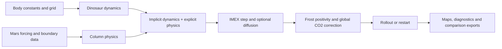

# GCM architecture

The primary model is a JAX 3-D general-circulation system. Generic dynamics and
column operators are separated from Mars constants, boundary data and outputs.
The torch `Planet`/`TimeController` model is deprecated and does not drive the GCM.

## Layers and dependency direction

| Layer | Implementation | Responsibility |
| --- | --- | --- |
| Body and units | `framework.gcm.body`, `specs` | SI constants and body-based nondimensionalization |
| Grid | `framework.gcm.coordinates` | Spherical harmonics and terrain-following sigma levels |
| Dynamics | `framework.gcm.dynamics` | Dinosaur dry primitive equations and IMEX stepper |
| Column physics | `framework.physics.gcm`, `ames_radiation` | Explicit radiation, heat/momentum, regolith and CO₂ tendencies |
| Mars configuration | `celestials.planets.mars` | Constants, forcing, MOLA/TES/dust adapters and maps |
| Learning | `framework.gcm.learning`, `framework.neural` | Parameterized rollouts, replacement radiation and heating |
| Experiments | `apps/mars-calibration`, `scripts` | Frozen inputs, optimization, ablations and acceptance |
| Presentation | `cli`, `ui` | Browser runs, map exports and cached reference reports |

Mars configures framework operators; generic operators do not import Mars.
`BodyConstants` is a pure-Python boundary. A new body also needs appropriate gas
physics and data; changing constants alone does not validate another climate.

## State and integration

```mermaid
flowchart LR
    B[Body constants and grid] --> D[Dinosaur dynamics]
    M[Mars forcing and boundary data] --> P[Column physics]
    D --> E[Implicit dynamics + explicit physics]
    P --> E
    E --> S[IMEX step and optional diffusion]
    S --> C[Frost positivity and global CO2 correction]
    C --> R[Rollout or restart]
    R --> O[Maps, diagnostics and comparison exports]
```

`ColumnPhysicsState` wraps the spectral dynamics with non-advected surface
temperature, frost and soil layers. The dynamics state carries vorticity,
divergence, temperature variation, log surface pressure, tracers and simulation time.
Physical arrays are converted to solver units at the boundary.

Physics enters Dinosaur's explicit tendencies; its implicit gravity-wave solve
is preserved. The timestep is IMEX-RK-SIL3, not the deprecated model's RK4 or
analytic fast update. Energy-limited CO₂ runs repair negative frost and restore
the Gaussian-quadrature global atmosphere/frost inventory after a complete step,
subtracting configured escape.

## Differentiation, output and persistence

Use parameterized steps and `rollout` for training objectives. Resolution and
counts are static; `remat=True` trades reverse-mode memory for recomputation.
Keep plotting, dataset conversion and checkpoint I/O outside differentiated kernels.
Neural radiation replaces a flux calculation; bounded heating adds a tendency.
Temperature-only postprocessing trains on cached outputs instead.

Restart NPZ stores complete state with versioned JSON metadata and no pickle.
Keep forcing, grid, precision, diffusion, boundary-data hashes and experiment
settings alongside it. Repeatability and conservation tests do not alone establish
observational skill or equilibrium.

## Detailed guides

- [Mars configuration](mars.md).
- [Component architecture](../package/gcm3d/architecture.md).
- [Physics and budgets](../package/gcm3d/implementation.md).
- [API interfaces](../package/gcm3d/api.md).
- [Calibration](../package/gcm3d/calibration.md) and [validation](../package/gcm3d/validation.md).
- [Deprecated torch architecture](global-mean-planet.md).
