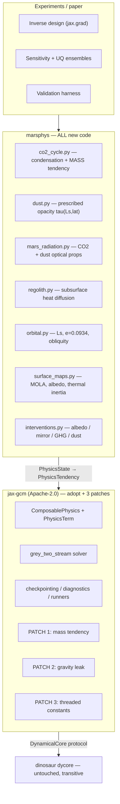
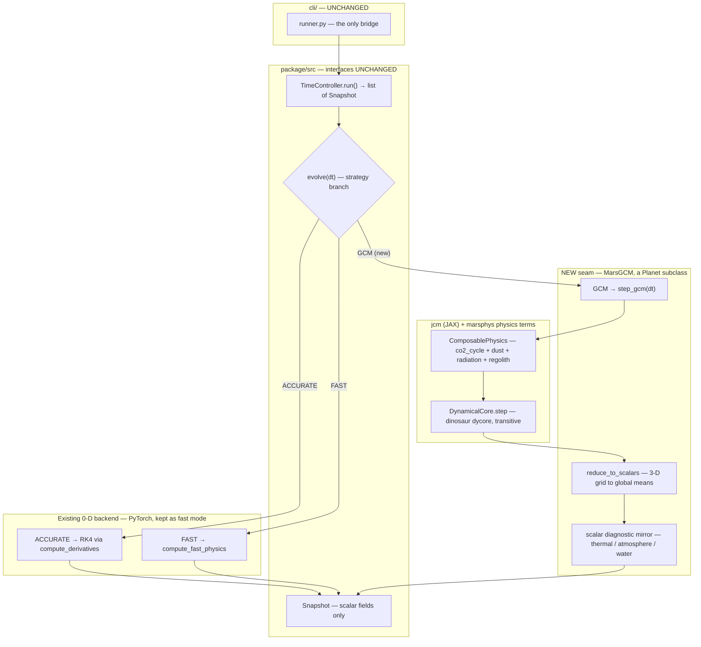
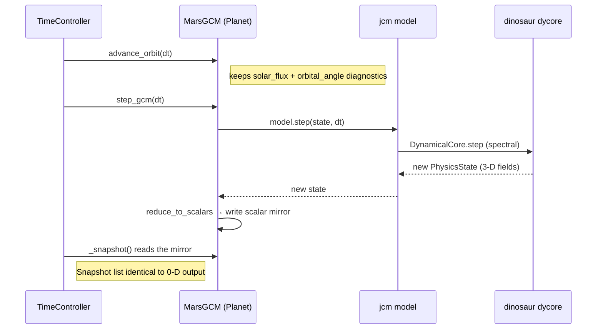

# A Differentiable Framework for Terraforming Mars — Implementation Plan

> **Status:** planning document. Nothing here is built yet.
> **Target:** ICLR 2027 (~16–24 Sept 2026). **Written:** 27 July 2026.
> **Decision record:** supersedes the in-house `gcm3d` dinosaur wrapper (PRs #36/#37/#38).

---

## 1. Thesis

> **The first differentiable 3-D Mars general circulation model, and gradient-based
> inverse design of climate interventions within it.**

The contribution is **not** a better Mars climate model — it will not be, and it is
validated *against* the established ones. The contribution is that a differentiable
model yields exact ∂(any diagnostic)/∂(any parameter or forcing), enabling
gradient-based optimisation, parameter estimation, and sensitivity analysis that
Fortran GCMs (Ames MGCM, LMD Mars PCM) structurally cannot do.

**Novelty is verified.** The Aircast-Mars authors state in print that the hybrid
differentiable-dycore approach *"has not yet been applied to Mars"*
([arXiv:2607.19370](https://arxiv.org/abs/2607.19370)).

**Framing discipline.** [Jakosky & Edwards (2018)](https://doi.org/10.1038/s41550-018-0529-6)
showed the accessible CO₂ inventory is far short of what terraforming requires. We
therefore claim **intervention response and sensitivity**, never feasibility.

---

## 2. Foundation — what is already verified to work

Each row was tested, not assumed.

| Fact | Evidence |
|---|---|
| dinosaur runs Mars dry dynamics **stably** | T21/12L, 200 steps, bounded state (PR #37) |
| …and **differentiably** | `jax.grad` vs finite-diff, rel-err **2.4×10⁻⁵** (PR #37) |
| Throughput T21/20L | **115 steps/s CPU → 4.8 min / Mars-year** (measured) |
| Throughput T42/20L | 38 steps/s → 14.4 min / Mars-year (measured) |
| JCM is **planet-configurable by design** | `constants.py`: *"Call `set_constants` to rebind it (e.g. for a different planet)"* |
| Mars constants build in JCM | ran `physics_specs_from_constants(Mars)` → radius 3.3895e6, Ω 7.088e-5, g 3.72076, R 188.92, κ 0.2454 ✓ |
| JCM tests pass | 30/30 (`physics_interface`, `dycore/protocol`, `base`) |
| `grey_two_stream` is **planet-agnostic** | generic two-stream solver over `tau`, `ssa`, `g`, Planck — only optical properties are planet-specific |
| `HeldSuarez` honours `set_constants` | documented; gives circulating Mars with zero radiation code (scaffold only) |
| Gradient checkpointing exists | `ComposablePhysics(checkpoint_terms=True)` |
| License | **Apache 2.0** |

**Repo version note:** the GMD paper describes JCM **v1.0**; the repo
([climate-analytics-lab/jax-gcm](https://github.com/climate-analytics-lab/jax-gcm))
is at **2.0.1**. Pin a commit.

### Verified problems (both fixable)

1. **`PhysicsTendency` cannot change atmospheric mass.** Fields are
   `u_wind, v_wind, temperature, specific_humidity, tracers` — no surface-pressure
   term. Earth's dry-mass-conservation assumption. **Mars condenses ~25–30 % of its
   atmosphere annually**, so this is a blocker. → **Patch 1.**
2. **Earth-gravity leak.** `jcm/dycore/dinosaur/state_bridge.py` lines 88–89, 99–100
   use dinosaur's `scales.GRAVITY_ACCELERATION` = **9.80616** (Earth) for
   geopotential instead of the configured constant — a 2.6× error on Mars.
   4 lines, localised. → **Patch 2.**

---

## 3. Architecture



**Discipline:** `marsphys` imports `jcm`, **never `dinosaur`**. Mars physics only ever
sees a gridpoint `PhysicsState` and returns a `PhysicsTendency`. JCM's own contract:
*"the only sanctioned bridge… physics packages never see spectral coefficients."*
This keeps us portable across dycore backends.

---

## 3.5 Where JCM fits — hooking into the existing package

The framing above (`marsphys` as a standalone paper track) is the *research* view.
The *engineering* view is: **JCM becomes a third simulation backend behind the
package's existing interfaces**, with the 0-D PyTorch box model kept intact as a fast
mode. Nothing in `cli/`, `Snapshot`, or the plotting/output layer changes — the seam
is a single new strategy branch.

### The seam in one picture



**JCM sits one level below a new `Accuracy.GCM` branch in `evolve()`.** It never touches
the CLI or `Snapshot`; a reduction layer collapses its 3-D state to the four scalars the
existing `Snapshot` already carries. The torch box model stays reachable under
`FAST`/`ACCURATE` — this *adds* an engine, it does not delete one.

### One timestep — exactly where JCM is called



The only crossing of the JAX↔PyTorch boundary is inside `reduce_to_scalars`: three
JAX scalars (`T_mean`, `ps_mean`, `co2_ice`) cast to torch and written into the mirror
— one host sync per snapshot, negligible.

### Mars properties → which system owns them

"Adding a property of Mars" means routing it to the right subsystem. Each property is
one of five kinds, and its kind decides where the code goes:

| Mars property | Subsystem / module | Feeds into | Backend owner | Kind |
|---|---|---|---|---|
| Topography (MOLA) | `marsphys/surface_maps.py` | surface geopotential, spatial p_s | JCM boundary | static map |
| Surface albedo (TES/THEMIS) | `surface_maps.py` | SW radiation | `mars_radiation.py` | static map |
| Thermal inertia | `regolith.py` | subsurface heat diffusion | new `PhysicsTerm` | prognostic field |
| CO₂ condensation / sublimation | `co2_cycle.py` | **mass tendency** (Patch 1) + latent heat | new `PhysicsTerm` | prognostic field + tendency |
| Dust opacity τ(Ls, lat) | `dust.py` | SW + LW radiation | prescribed forcing | forcing term |
| Orbital (e, obliquity, Ls_peri) | `orbital.py` | insolation / solar geometry | drives `advance_orbit` + radiation | planetary constant |
| Rotation Ω, gravity g, gas const R, radius | `constants.py` (Patch 3) | dycore + geopotential | threaded pytree | planetary constant |
| Composition / injected PFCs | ported `interventions/compounds.py` | LW optical depth | `mars_radiation.py` | forcing term |
| Winds u,v, temperature T, humidity q | JCM `PhysicsState` (native) | dynamical core | JCM | prognostic field (built-in) |

### Recipe — adding a new Mars property to the right system

1. **Prognostic field** (evolves in time, e.g. regolith temperature, CO₂ ice mass):
   add it as a `PhysicsState` field or JCM tracer; write its rate of change in a
   `PhysicsTerm.tendency()`.
2. **Forcing / tendency** (modifies existing fields, e.g. dust, PFC opacity):
   add a `PhysicsTerm` and compose it — `mars_base + DustForcing(...)`.
3. **Static boundary map** (fixed in time, e.g. topography, albedo):
   load into `surface_maps.py`; it becomes a boundary array the terms read.
4. **Planetary constant** (scalar per planet, e.g. gravity, obliquity):
   put it in the threaded constants pytree (Patch 3); never a global singleton.
5. **Diagnostic only** (something to *observe*, e.g. cap extent): add it to
   `reduce_to_scalars` **and** the `Snapshot` dataclass — the only case that touches
   the package interface, and even then only additively.

Rule of thumb: if the CLI must *display* it, it ends up in `Snapshot` (kind 5); if it
only *influences* the climate, it stays inside a JCM `PhysicsTerm` (kinds 1–4) and never
crosses the seam.

---

## 4. Patches to JCM (upstreamable)

| # | Change | Files | Size |
|---|---|---|---|
| **1** | Add surface-pressure/mass tendency to `PhysicsTendency`; thread through `DynamicalCore.step` → dinosaur `log_surface_pressure` | `physics_interface.py`, `dycore/base.py`, `dycore/dinosaur/dycore.py` | **the spike** |
| **2** | Use configured gravity/gas-constant in geopotential | `dycore/dinosaur/state_bridge.py` | 4 lines |
| **3** | Constants: process-global singleton → threaded pytree (salvage `BodyConstants` from PR #36) | `constants.py` + consumers | small |

Patch 3 also unlocks `vmap` over planetary parameters and ∂/∂(planetary constant) —
useful beyond Mars.

---

## 5. Mars physics — exact parameters

### 5.1 `co2_cycle.py` — **non-negotiable, the core**

| Parameter | Symbol | Value / form | Notes |
|---|---|---|---|
| CO₂ frost point | `T_cond(p)` | `3182.48 / (23.3494 − ln p_Pa)` | **verify against Ames/PCM source before use** |
| Latent heat of sublimation | `L_sub` | 5.71×10⁵ J kg⁻¹ | |
| CO₂ ice albedo | `α_ice` | 0.6 (N), 0.5–0.65 (S) | tunable; drives cap energy balance |
| CO₂ ice emissivity | `ε_ice` | 0.8 (S), 0.95 (N) | **asymmetric — contested, and a key tuning knob** |
| Frost threshold for albedo switch | `m_thresh` | ~5–10 kg m⁻² | |
| Surface CO₂ ice reservoir | `m_ice(lat,lon)` | prognostic 2-D field | |
| Atmospheric condensation | — | when `T < T_cond(p)` aloft | CO₂ clouds; **v1 = surface only** |

Emits: temperature tendency (latent heat), **surface-pressure tendency (Patch 1)**,
surface albedo modification.

### 5.2 `dust.py` — **non-negotiable (prescribed form)**

| Parameter | Symbol | Value | Notes |
|---|---|---|---|
| Column optical depth | `τ_vis(Ls, lat)` | MCD dust scenario table | climatology / cold / warm / storm |
| Vertical distribution | Conrath `ν` | ~0.007–0.03 | `q(z) = q₀ exp[ν(1 − p₀/p)]` |
| Single-scattering albedo | `ssa_vis` | ~0.92 | ~0.6 in IR |
| Asymmetry parameter | `g` | ~0.65 (vis) | |
| Effective radius | `r_eff` | ~1.5 µm | |
| Visible→IR opacity ratio | — | ~2 | |

**Interactive dust lifting is out of scope** (unsolved research problem). Prescribed
opacity is what every Mars GCM ships as a "dust scenario", and it doubles as an
intervention lever.

### 5.3 `mars_radiation.py`

Supplies optical properties into JCM's existing `grey_two_stream`:

| Parameter | Value | Notes |
|---|---|---|
| Solar constant at Mars | 589 W m⁻² (mean, 1361/1.524²) | varies ±19 % over the orbit |
| CO₂ gas opacity | band-averaged for present day | |
| **CO₂ CIA** | required above ~0.1 bar | **contested magnitude** (Wordsworth vs Turbet/Boulet/Karman 2020) — flag in paper |
| Surface emissivity | 0.95 (regolith) | |
| Bands | ≥2 (SW + LW), grey within band | v1 |

### 5.4 `regolith.py`

| Parameter | Value |
|---|---|
| Thermal inertia `I` | map, 50–800 J m⁻² K⁻¹ s^(−1/2) |
| Subsurface layers | 10–20, geometric spacing |
| Bottom boundary | zero-flux, ≥ seasonal skin depth |
| Soil density / heat capacity | ~1500 kg m⁻³ / ~800 J kg⁻¹ K⁻¹ |

### 5.5 `orbital.py` and `surface_maps.py`

| Parameter | Value |
|---|---|
| Semi-major axis | 1.5237 AU (2.279392×10¹¹ m) |
| Eccentricity | **0.0934** |
| Obliquity | 25.19° |
| Ls at perihelion | **251°** ← drives the N/S asymmetry |
| Sol / year | 88 775.244 s / 668.6 sols |
| Topography | **MOLA** (~20 km relief; sets a 3.6× spatial pressure range) |
| Surface albedo / thermal inertia | TES/THEMIS maps |

> **Why topography is non-negotiable:** hydrostatic `P = 610·exp(−z/11.1 km)` gives
> **355 Pa at Tharsis (+6 km)** and **1162 Pa at Hellas (−7.1 km)** — a 3.6× spatial
> range, **~3× larger than the entire seasonal cycle**. Verified against an Ames MGCM
> snapshot.

---

## 6. Interventions

Three orthogonal levers on the energy budget, plus a fourth from `dust.py`.

| # | Intervention | Lever | Differentiable parameters | Effort |
|---|---|---|---|---|
| 1 | **Polar-cap albedo reduction** | SW absorption | Δα, lat/lon mask, start time, ramp rate | ★ |
| 2 | **Orbital mirrors** | SW input | added flux (W m⁻²), target region, schedule | ★ |
| 3 | **PFC injection** (SF₆, CF₄, C₂F₆) | LW opacity | kg s⁻¹ per compound, schedule | ★★ |
| 4 | *(bonus)* **Dust injection** | SW+LW | Δτ, region, schedule | ★ |

Ports from the existing `package/src/interventions/`: **`compounds.py`** (radiative
efficiencies + Mars-adjusted lifetimes for 7 PFCs, cited to IPCC AR5/AR6 and
Ravishankara 1993) and the schedule/controller API. **Rewritten:** `forcing.py`'s
scalar `greenhouse_factor` — in 3-D, GHGs must contribute real optical depth.

All four act primarily **through the CO₂ cycle** (warm caps → sublimate → thicker
atmosphere → more greenhouse → warm further). That positive feedback — and whether it
has a tipping point — is the scientifically interesting object.

Composition is native to JCM:
```python
physics = mars_base + PolarAlbedoForcing(...) + OrbitalMirror(...)
```

---

## 7. Validation strategy

### 7.1 Options compared

| Source | Pros | Cons |
|---|---|---|
| **Observations** (Viking pressure, MCS T, TES/THEMIS T_surf) | Unarguable ground truth; no model bias; Viking is *the* CO₂-cycle benchmark | Sparse; limited variables; Viking includes the 1977 dust-storm years |
| **MCD 6.1** (LMD) | Easiest access; community standard; full lat/lon/alt/Ls coverage; ships dust scenarios | It is a *statistical database*, not trajectories; LMD's model, **not Ames's** |
| **Ames MGCM** | Kahre's own model → collaboration value; now public ([nasa/AmesGCM](https://github.com/nasa/AmesGCM)); could run matched experiments | Must run it ourselves (Fortran/MPI, cluster, setup risk); or depend on her time |
| **Mars PCM** (LMD) | Open source; runs 0.1–7 bar (Forget 2013) — directly relevant to terraforming | SVN; no existing relationship; setup burden |

### 7.2 Recommendation — tiered

1. **Primary: observations.** Viking sol-averaged surface pressure
   (`VL1/VL2-M-MET-4-DAILY-AVG-PRESS`, PDS Atmospheres Node) for the CO₂ cycle;
   MCS for zonal-mean temperature. *Nobody can dispute validation against real data.*
2. **Secondary: MCD 6.1.** For fields observations don't cover (winds, full 3-D
   structure) and for the dust scenario definitions we prescribe anyway.
3. **Tertiary: Ames MGCM.** Ask Kahre for two small 1-D arrays rather than running it:
   **(a)** global-mean surface pressure time series over ≥1 Mars year post-spin-up,
   **(b)** a VL1 point time series. Cheap for her, exactly what we need.

**Do not** attempt to run Ames or PCM ourselves before September — setup risk is not
worth it. Ask for output.

### 7.3 Scorecard

| Priority | Diagnostic | Reference | Gate |
|---|---|---|---|
| **1** | Seasonal surface-pressure cycle at VL1/VL2 | Viking (PDS) | amplitude within ~20 %, phase within ~20° Ls |
| **1** | Global-mean p_s + mass conservation | internal + Ames | drift < 1 %/yr |
| **2** | Zonal-mean T(p, Ls) | MCS / MCD | qualitative structure |
| **2** | Surface temperature (diurnal + seasonal) | TES/THEMIS/MCS | ±10 K |
| 3 | Seasonal cap extent | GRS-NS, albedo obs | |
| 3 | Thermal tides (diurnal p harmonics) | Viking, REMS | |

**Data hygiene:** current Viking arrays in `scripts/mcd_pressure_comparison.py` are a
**coarse digitisation by us, not the archive**. Replace with PDS before publication.
State which Mars year is used — the Viking record spans the 1977 global dust storms
(hence Tillman et al. 1993, *"Years without great dust storms"*).

---

## 8. Risks and gates

| Risk | Severity | Gate | Mitigation |
|---|---|---|---|
| **Gradients through 3-D rollouts infeasible** (memory/time) | **fatal to thesis** | Spike B, day 5 | checkpointing; shorter horizons; adjoint |
| Mass tendency fights the semi-implicit dycore | high | Spike A, day 3 | dinosaur already carries `log_surface_pressure` prognostically |
| Radiation eats the schedule | high | week 4 | grey/2-band only; defer CIA |
| CO₂ cycle doesn't match Viking | medium | week 4 | tune ice albedo/emissivity — the accepted knobs |
| Scooped | medium | ongoing | ship; consider GMD/JGR-Planets as venue B |

**Out of scope, with stated cost:** water cycle *(bounds claims to the dry/CO₂ regime
— cannot claim habitability)*; water-ice and CO₂ clouds *(adds acknowledged
uncertainty at high pressure — Forget 2013)*; interactive dust lifting; photochemistry;
thermosphere.

---

## 9. Timeline

| Wk | Work | Gate |
|---|---|---|
| **1** | **Spike A** (mass tendency) ∥ **Spike B** (checkpointed gradients). Patches 2–3. | **GO/NO-GO by day 5** |
| 2 | Mars constants + `orbital.py` + `surface_maps.py` (MOLA). HeldSuarez scaffold. | Dry Mars stable 1 yr; matches PR #37 |
| 3–4 | **`co2_cycle.py`** + `dust.py` + `mars_radiation.py` → grey_two_stream | **Seasonal p_s cycle vs Viking** ← credibility milestone |
| 5 | Interventions 1–2 (★), then 3 | sane climate response each |
| 6 | **Inverse design** — optimise schedules by backprop; per-lever sensitivity | headline result |
| 7 | Write-up, figures, ablations | |

**Week 4 is the checkpoint.** If the 3-D seasonal pressure cycle matches Viking, there
is a paper. If not, the claim narrows to method + forward sensitivity.

---

## 10. Immediate actions

1. Run **Spike A** and **Spike B** — nothing else matters until these pass.
2. Merge PRs **#42 → #43 → #44** (0-D bug fixes + the Viking comparison harness, which
   is reused to validate the 3-D model in week 4).
3. Close **#36/#37/#38/#39/#40**; preserve #37's evidence in this document.
4. Email Kahre: scope check + request the two Ames time series (§7.2).
5. Email Watson-Parris (UCSD, `dwatsonparris@ucsd.edu`): offer patches 1–3 upstream.
6. Download Viking `DAILY-AVG-PRESS` from PDS; replace the digitised arrays.

## 11. References

- Kochkov et al. (2024), *Neural general circulation models*, Nature — dinosaur dycore
- JCM v1.0, *GMD* **19**, 6451 (2026); code [climate-analytics-lab/jax-gcm](https://github.com/climate-analytics-lab/jax-gcm) v2.0.1
- Hess et al. (1980), *GRL* **7**, 197 — Viking annual pressure cycle
- Tillman et al. (1993), *JGR* **98** — years without great dust storms
- Guo et al. (2009), *JGR* **114**, E07006 — fitting Viking with a GCM
- Forget et al. (2013), *Icarus* — early Mars 0.1–7 bar, CO₂ ice clouds
- Jakosky & Edwards (2018), *Nat. Astron.* — CO₂ inventory
- Greybush et al. (2019), *GDJ* **6**, 137 — EMARS
- ARCO-Mars (2026), [arXiv:2606.21701](https://arxiv.org/abs/2606.21701)
- Aircast-Mars (2026), [arXiv:2607.19370](https://arxiv.org/abs/2607.19370)
