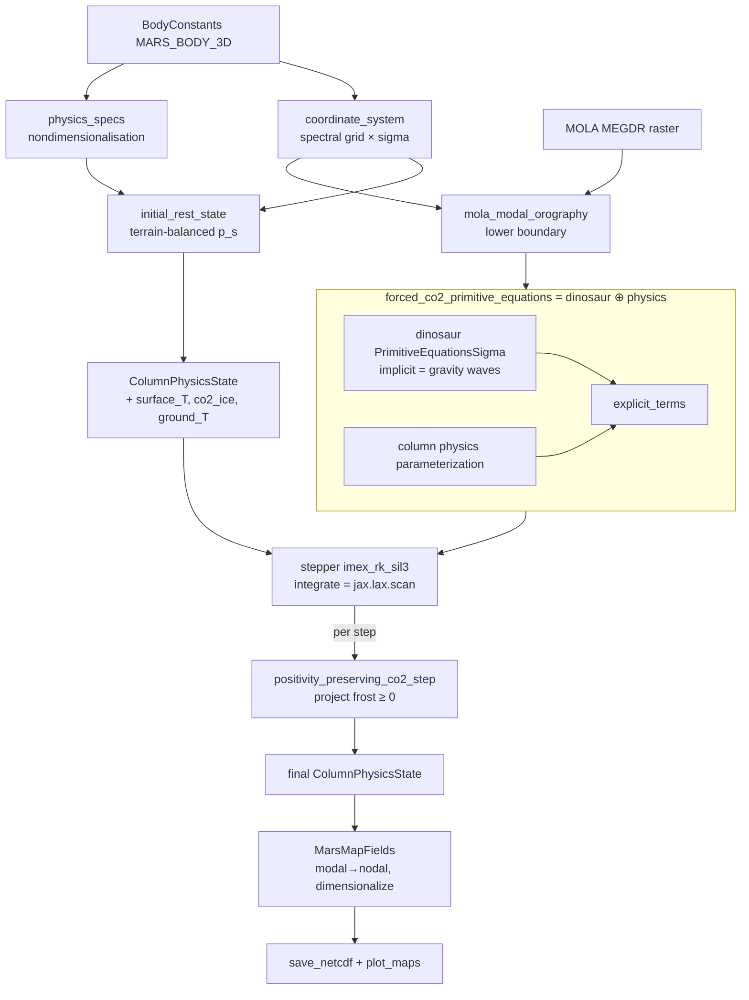

# Architecture — gcm3d

## Component Overview

`gcm3d` layers cleanly from a pure-Python base up to output:

| Layer | Modules | Depends on JAX? |
|-------|---------|-----------------|
| Body abstraction | `body.py` (`BodyConstants`, `EARTH`) | No — always importable |
| Dependency guard | `_dinosaur.py` | — (raises if extra missing) |
| Discretisation | `coordinates.py` (spectral grid × sigma), `specs.py` (nondimensionalisation) | Yes |
| Dry dynamical core | `dynamics.py` (`primitive_equations`, `stepper`, `integrate`) | Yes |
| Column physics | `physics.py` (radiation, surface energy, drag, PBL, convection, CO₂ cycle), `ames_radiation.py` (correlated-k tables) | Yes |
| Boundary data | `topography.py` (MOLA orography), `surface.py` (albedo/TI), `dust.py` (Ames dust) | topography: Yes; surface/dust: NumPy+xarray |
| Experiments | `maps.py` (3-D Mars maps), `terraforming_ode.py` (0-D seasonal), `benchmarks.py` (dycore acceptance), `restart.py` (spin-up/averaging), `mcd.py` (MCD validation client) | mostly Yes |

The Mars instance and the convenience entry point `mars_gcm3d_core()` live in
`src/celestials/planets/mars.py`, keeping the core planet-agnostic.

## Flow Diagram — the forced 3-D map run

The **physics parameterization** (one step, per grid column) sums, in order:
radiative surface energy + latent CO₂ heating (temperature/surface tendency),
surface drag + PBL vertical diffusion (momentum), dry convective adjustment
(temperature), and the CO₂ mass exchange (`d ln p_s`, frost, latent surface heat).

## Key Architectural Choices

1. **Physics is added to `explicit_terms`, never the implicit side.**
   - **Why**: dinosaur's implicit solve is the gravity-wave semi-implicit
     linearisation; physics is a slow forcing. Keeping it explicit preserves the
     dycore's stability contract and its `implicit_inverse` unchanged.
   - **Alternative rejected**: relaxing to a prescribed rest temperature (Held–Suarez
     style) — that cannot develop the model's *own* subsolar-hot / nightside-cold
     structure, which is what drives the circulation.

2. **`ColumnPhysicsState` = dinosaur `State` + non-advected surface reservoirs.**
   - **Why**: surface temperature, CO₂ frost, and multilayer ground temperature
     sit on the ground and must not be horizontally advected. Wrapping the dycore
     state in a JAX-pytree NamedTuple keeps the dynamics intact while carrying them.
   - **Alternative rejected**: dinosaur tracers — those *are* transported by wind.

3. **Nondimensionalisation is body-anchored (length=radius, time=1/2Ω).**
   - **Why**: dinosaur's spectral `Grid` assumes radius 1 and Ω=0.5. Building the
     scale from each `BodyConstants` (`specs.py`) makes any body satisfy that
     without patching dinosaur's Earth-hardcoded `scales.py`.

4. **CO₂ mass exchange changes atmospheric mass through `log_surface_pressure`.**
   - **Why**: condensing CO₂ to frost removes atmospheric mass locally; the
     tendency is applied as `d(ln p_s)/dt` on the dycore's own prognostic surface
     pressure, and a per-step projection enforces frost ≥ 0 with exact per-cell
     mass conservation `d(p_s) = −d(ice) − escape`. (This is the "deeper dycore
     patch" a one-line tendency could not provide.)

## Dependencies

- **`dinosaur`** (JAX): spectral transforms, sigma coordinates, `PrimitiveEquationsSigma`,
  `imex_rk_sil3`, published initial states (`isothermal_rest_atmosphere`,
  `steady_state_jw`), `held_suarez` forcing, `xarray_utils`.
- **JAX**: autodiff, `lax.scan`, `vmap`, `jit`.
- **NumPy / xarray**: raster IO, NetCDF export, boundary-field regridding.
- **matplotlib** (`plot_maps` only, Agg backend).
- Staged assets: MOLA MEGDR raster (`data/mola/…`), Ames CO₂ 12-band table
  (`ames_co2_12band.npz`, bundled), optional TES surface + Ames dust NetCDFs.

## Extension Points

- **New body**: define a `BodyConstants`; everything else is generic.
- **New / learned column physics**: implement a `parameterization(state) ->
  ColumnPhysicsTendencies` and wrap with `column_primitive_equations` — the
  NeuralGCM-style residual-tendency seam.
- **Better radiation**: `two_stream_radiative_fluxes` isolates the optical-depth
  closure; correlated-k coefficients replace it without changing callers.
- **New surface/dust data**: `surface.py` / `dust.py` interpolate any conforming
  dataset onto the grid.
