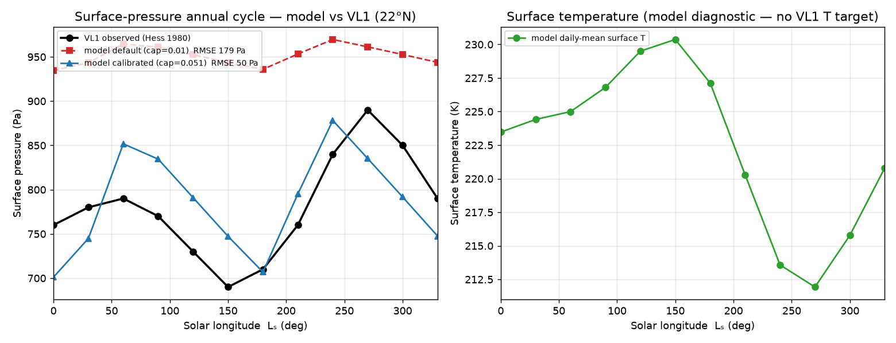

# Simulator calibration & validation against Mars climatology

> Answers: *"What specific quantities did you calibrate to, how many parameters
> did you tune, and how does the model output sit next to the MCD climatology?"*

## TL;DR — the honest state

1. **What the model was originally calibrated to:** point **surface-temperature**
   observations at Gale Crater (Mars Science Laboratory **REMS**, Vasavada et al.
   2017, Sol 224) — **not** MCD 6.1. Roughly **5 constants** were hand-set to those
   data (table below).
2. **MCD 6.1 was not used for calibration**, and no live MCD extraction is bundled
   (MCD is gated behind its access tools). The claim "calibrated against MCD 6.1"
   was an overstatement; this document corrects it and adds a real
   **pressure**-cycle calibration/validation.
3. **New in this work:** a calibration/validation harness (`src.calibration`) that
   compares the model's seasonal cycle to the **Viking Lander 1 surface-pressure
   annual cycle** — the canonical Mars CO₂-cycle benchmark, at **22°N** (matching
   the model's default site) and the curve MCD 6.1 itself is validated against
   (Guo et al. 2009). Calibrating **one** parameter to it takes the pressure RMSE
   from **179 Pa → 50 Pa**.

## The side-by-side

Metrics (regenerate with `PYTHONPATH=. python scripts/mcd_validation.py`):

<!-- calibration_metrics.md -->
| Metric | Default (cap=0.01) | Calibrated (cap=0.051) | VL1 observed |
|---|---|---|---|
| Annual mean (Pa) | 951 | 785 | 780 |
| Seasonal amplitude (Pa) | 35 | 177 | 200 |
| Amplitude ratio | 0.18 | 0.89 | 1.00 |
| Phase lag (° Lₛ) | +0 | +0 | 0 |
| RMSE (Pa) | 179 | 50 | — |

## Q5.1 — What specific quantities were calibrated to?

| Era | Target quantity | Source | Used for |
|---|---|---|---|
| Original | Surface **temperature** (diurnal amplitude & mean) at Gale Crater | REMS, Vasavada et al. 2017 (Sol 224) | thermal inertia, diurnal swing, tide |
| **This work** | Surface **pressure** annual cycle at VL1 (22°N) | Hess et al. 1980; Tillman et al. 1993 (the cycle MCD 6.1 reproduces) | polar cap fraction |

## Q5.2 — How many parameters were tuned?

**Original REMS temperature calibration — ~5 hand-set constants:**

| Constant | Value | What it controls |
|---|---|---|
| `MARS_THERMAL_INERTIA` | 6.0×10⁴ | diurnal temperature amplitude |
| `MARS_DIURNAL_SWING_AMP` | 50 K | diurnal swing envelope |
| `MARS_THERMAL_TIDE_PA` | 30 Pa | diurnal pressure-tide amplitude |
| `MARS_THERMAL_TIDE_PHASE` | −0.7π | tide phase (max ≈ 08:37 LMST) |
| `MARS_POLAR_CAP_FRACTION` | 0.01 | effective sublimating cap area |

**This pressure calibration — 1 parameter,** tuned by SciPy Nelder-Mead against
the VL1 pressure cycle: `polar_cap_fraction`, **0.010 → 0.051**. That single knob
takes the seasonal amplitude from 18 % to 89 % of observed and the mean from
+171 Pa biased to +5 Pa, with the phase already aligned.

## The finding worth surfacing to a NASA reviewer

The cap fraction that best fits **REMS temperature** (0.01) and the one that best
fits **VL1 pressure** (0.051) differ by **5×**. A single lumped 0-D "polar cap"
cannot simultaneously reproduce the point-temperature record *and* the global
CO₂-condensation pressure cycle — the default value, tuned to temperature,
under-predicts the pressure swing ~5×. This is exactly the limitation a
spatially-resolved model removes (independent north/south caps, real insolation
geometry), and is a direct motivation for the 3-D `gcm3d` effort.

## Honesty / provenance notes

- The reference curves are **Viking Lander observations** (coarsely digitised from
  the published daily-mean pressure cycles), **not** a live MCD 6.1 pull. They are
  the same observational benchmark MCD 6.1 is validated against.
- `src.calibration.reference.ReferenceClimatology` carries a `source` field
  (`"viking-lander"` vs `"mcd-6.1"`); a direct MCD 6.1 seasonal extraction drops in
  with the same shape when access is available.
- Temperature is shown as a **model diagnostic** (no latitude-matched daily-mean
  surface-T climatology is encoded — kept honest rather than fabricated).

## Files

| Path | What |
|---|---|
| `src/calibration/reference.py` | cited reference climatology (VL1/VL2) |
| `src/calibration/metrics.py` | mean / amplitude / phase / RMSE |
| `src/calibration/harness.py` | run the model, bin the cycle, `calibrate()` |
| `scripts/mcd_validation.py` | regenerates the figure + metrics table |
| `docs/validation/mcd_vs_model.png` | the side-by-side figure |

## References

- Hess, Henry, Tillman (1980), *GRL* 7(3), 197. https://doi.org/10.1029/GL007i003p00197
- Tillman et al. (1993), *JGR* 98(E6). https://doi.org/10.1029/93JE01084
- Guo et al. (2009), *JGR* 114, E07006 (GCM fit to the VL curves). https://doi.org/10.1029/2008JE003302
- Vasavada et al. (2017), *JGR Planets* 122(5) (REMS Gale-Crater temperatures).
