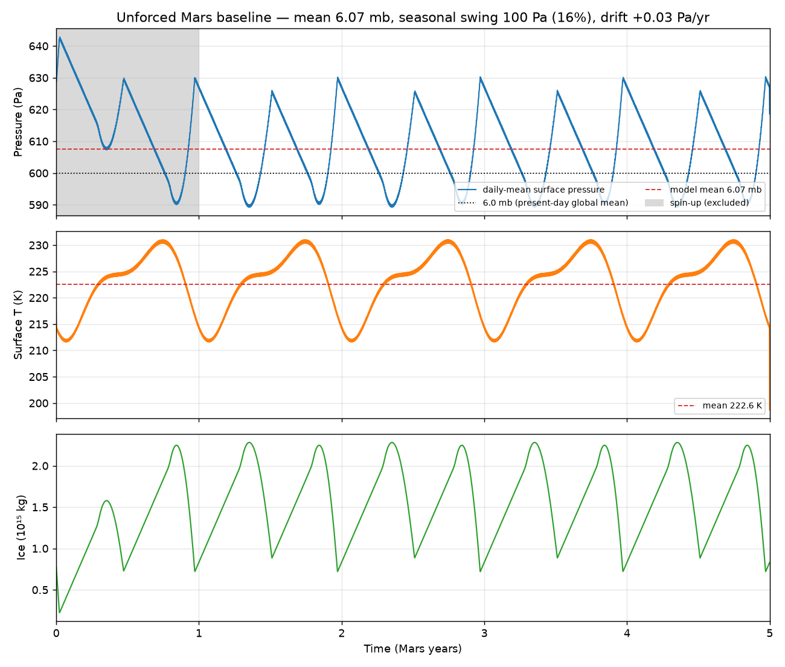

# Present-day baseline: is the unforced model a stable state?

> Answers: *before any forcing, does the model reproduce present-day Mars — the
> ~6 mb mean pressure and the seasonal pressure swing — as a stable state?*

## TL;DR — **Yes.**

Run with no forcing from CO₂-budget-consistent present-day initial conditions,
the model relaxes within one Mars year to a **stable, exactly-repeating annual
limit cycle**:

| Quantity | Model | Present-day Mars |
|---|---|---|
| Mean surface pressure | **6.07 mb** | ~6.1 mb |
| Seasonal swing | 100 Pa (**16 %**) | ~25–30 % (Viking) |
| Swing repeatability (σ across years) | **0.05 Pa** | — |
| Pressure drift | **+0.033 Pa/yr** (+0.5 %/century) | — |
| Temperature drift | +0.0005 K/yr | — |
| Ice drift | ~0 kg/yr | — |
| **Stable limit cycle?** | **YES** | — |



Years 1–4 (after the shaded spin-up year) sit on top of each other: pressure,
temperature (mean 222.6 K), and cap ice all repeat with σ ≈ 0. There is no
secular runaway.

## The three things a reviewer should know

**1. The only non-periodic term is physical, and tiny.** The annual-mean pressure
drifts by **+0.5 %/century** — the MAVEN non-thermal escape sink (0.2 kg/s,
Jakosky et al. 2018). Over the present-day epoch this is negligible; it is a real
physical loss, not numerical drift. (The sign is slightly positive here because
the caps are still settling by <0.1 Pa/yr; escape alone is a slow negative term.)

**2. The stable mean is set by the CO₂ inventory — which must be chosen, not
assumed.** The model's cap reservoir has a robust attractor at ~1.59×10¹⁵ kg, but
the equilibrium *pressure* follows the total CO₂ (atmosphere + caps). The code's
**default 5×10¹⁵ kg cap is not consistent with a 6 mb atmosphere** — its excess
CO₂ sublimates during spin-up and inflates the baseline to **~7.15 mb** (+17 %).
The budget-consistent present-day inventory (atmosphere at 610 Pa, cap ~0.8×10¹⁵
kg initially → 1.59×10¹⁵ at the attractor) lands the stable state at **6.07 mb**.
`assess_baseline` uses those consistent defaults; the inflation with the default
cap is captured as a regression test.

**3. The seasonal amplitude is under-predicted (16 % vs 25–30 %).** Same limitation
surfaced by the VL1 calibration ([README.md](README.md)): a single lumped 0-D
polar cap cannot reproduce the amplitude of the real two-cap condensation cycle.
The mean, phase, and stability are right; the swing is ~half of observed. This is
a direct motivation for the spatially-resolved `gcm3d` model (independent N/S
caps, real insolation geometry).

## How to reproduce

```bash
cd package
PYTHONPATH=. python scripts/baseline_stability.py   # writes the figure + metrics
```

or programmatically:

```python
from src.calibration import assess_baseline
s = assess_baseline(n_years=6, spinup_years=1)
print(s.mean_pressure_mb, s.seasonal_swing_pa, s.pressure_drift_pa_per_year, s.is_stable())
```

## Relationship to the calibration PR

This is the **"before forcing" baseline** Kahre asked for; the VL1 pressure-cycle
**calibration** is a separate step ([README.md](README.md), PR #39). This work
stacks on that branch and reuses nothing from it beyond the shared validation
package. Order: baseline (this) establishes the model is a stable present-day
attractor; calibration then tunes the seasonal amplitude at a site.

## Files

| Path | What |
|---|---|
| `src/calibration/baseline.py` | `run_unforced`, `summarize_baseline`, `assess_baseline`, `BaselineStability` |
| `scripts/baseline_stability.py` | regenerates the figure + metrics |
| `docs/validation/baseline_stability.png` | the multi-year time series |
| `docs/validation/baseline_metrics.md` | the metrics table |

## References

- Jakosky et al. (2018), *Icarus* — MAVEN non-thermal escape rate.
- Hess et al. (1980); Tillman et al. (1993) — Viking seasonal pressure swing.
